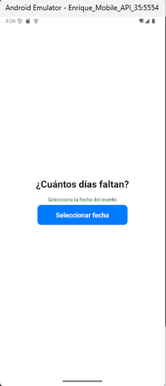
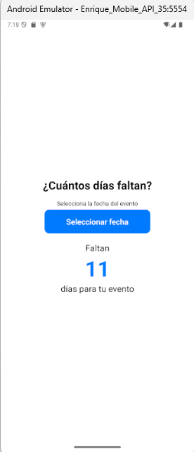

# 📅 Contador de Días para un Evento

Esta app permite al usuario seleccionar una fecha futura y ver cuántos días faltan para su evento especial. Incluye nombre personalizado del evento, almacenamiento persistente, imagen de celebración y notificaciones locales.

## 🚀 Tecnologías Usadas
- React Native
- Expo
- AsyncStorage
- expo-notifications
- DateTimePicker

## 📦 Instalación

```bash
git clone https://github.com/EnriqueDeveloper/contador-dias-evento.git
cd contador-dias-evento
npm install
npx expo start

## 📱 Imagenes






